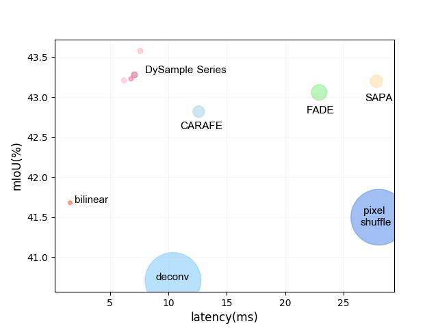

# DySample: Learning to Upsample by Learning to Sample

<p align="center"></p>

Code for the ICCV 2023 paper [Learning to Upsample by Learning to Sample](https://arxiv.org/abs/2308.15085).

We present DySample, an ultra-lightweight and effective dynamic upsampler. While impressive performance gains have been witnessed from recent kernel-based dynamic upsamplers such as CARAFE, FADE, and SAPA, they introduce much workload, mostly due to the time-consuming dynamic convolution and the additional sub-network used to generate dynamic kernels. Further, the need for high-res feature guidance of FADE and SAPA somehow limits their application scenarios. To address these concerns, we bypass dynamic convolution and formulate upsampling from the perspective of point sampling, which is more resource-efficient and can be easily implemented with the standard built-in function in PyTorch. We first showcase a naive design, and then demonstrate how to strengthen its upsampling behavior step by step towards our new upsampler, DySample. Compared with former kernel-based dynamic upsamplers, DySample requires no customized CUDA package and has much fewer parameters, FLOPs, GPU memory, and latency. Besides the light-weight characteristics, DySample outperforms other upsamplers across five dense prediction tasks, including semantic segmentation, object detection, instance segmentation, panoptic segmentation, and monocular depth estimation.

## Highlights

- **Fast:** DySample adopts very simple implementation for fast speed;
- **Easy to use:** DySample does not rely on any extra CUDA packages installed.

## Results

Object detection with Faster R-CNN on COCO
| Faster R-CNN | Backbone | Params |   $AP$   | $AP_{50}$ | $AP_{75}$ | $AP_S$   | $AP_M$   | $AP_{L}$ |  log  | ckpt  |
| :---:        |  :---:   | :---:  | :---:    | :---:     | :---:     | :---:    | :---:    | :---:    | :---: | :---: |
| Nearest      | R50      | 46.8M  | 37.5     | 58.2      | 40.8      | 21.3     | 41.1     | 48.9     |       |       |
| DySample     | R50      | +32.7K | 38.6     | 59.9      | 42.0      | 22.9     | 42.1     | 50.2     |[Link](https://github.com/tiny-smart/detection-with-upsamplers/releases/download/checkpoint/faster_rcnn_r50_fpn_dysample-lpg4_1x_coco.log)|[Link](https://github.com/tiny-smart/detection-with-upsamplers/releases/download/checkpoint/faster_rcnn_r50_fpn_dysample-lpg4_1x_coco.pth)|
| DySample+    | R50      | +65.5K | 38.7     | 60.0      | 42.2      | 22.5     | 42.4     | 50.2     |[Link](https://github.com/tiny-smart/detection-with-upsamplers/releases/download/checkpoint/faster_rcnn_r50_fpn_dysample-lpg4ds_1x_coco.log)|[Link](https://github.com/tiny-smart/detection-with-upsamplers/releases/download/checkpoint/faster_rcnn_r50_fpn_dysample-lpg4ds_1x_coco.pth)|
| Nearest      | R101     | 65.8M  | 39.4     | 60.1      | 43.1      | 22.4     | 43.7     | 51.1     |       |       |
| DySample+    | R101     | +65.5K | 40.5     | 61.6      | 43.8      | 24.2     | 44.5     | 52.3     |[Link](https://github.com/tiny-smart/detection-with-upsamplers/releases/download/checkpoint/faster_rcnn_r101_fpn_dysample-lpg4ds_1x_coco.log)|[Link](https://github.com/tiny-smart/detection-with-upsamplers/releases/download/checkpoint/faster_rcnn_r101_fpn_dysample-lpg4ds_1x_coco.pth)|

Instance segmentation with Mask R-CNN on COCO
| Bbox results | Backbone | Params |   $AP$   | $AP_{50}$ | $AP_{75}$ | $AP_S$   | $AP_M$   | $AP_{L}$ |
| :---:        |  :---:   | :---:  | :---:    | :---:     | :---:     | :---:    | :---:    | :---:    |
| Nearest      | R50      |   -    | 38.3     | 58.7      | 42.0      | 21.9     | 41.8     | 50.2     |
| DySample     | R50      | +32.7K | 39.2     | 60.3      | 43.0      | 23.5     | 42.5     | 51.0     |
| DySample+    | R50      | +65.5K | 39.6     | 60.6      | 43.5      | 23.5     | 43.1     | 50.8     |
| Nearest      | R101     |   -    | 40.0     | 60.4      | 43.7      | 22.8     | 43.7     | 52.0     |
| DySample+    | R101     | +65.5K | 41.0     | 61.9      | 44.9      | 24.3     | 45.0     | 53.5     |

| Segm results | Backbone | Params |   $AP$   | $AP_{50}$ | $AP_{75}$ | $AP_S$   | $AP_M$   | $AP_{L}$ |  log  | ckpt  |
| :---:        |  :---:   | :---:  | :---:    | :---:     | :---:     | :---:    | :---:    | :---:    | :---: | :---: |
| Nearest      | R50      |   -    | 34.7     | 55.8      | 37.2      | 16.1     | 37.3     | 50.8     |       |       |
| DySample     | R50      | +32.7K | 35.4     | 56.9      | 37.8      | 17.1     | 37.7     | 51.1     |[Link](https://github.com/tiny-smart/detection-with-upsamplers/releases/download/checkpoint/mask_rcnn_r50_fpn_dysample-lpg4_1x_coco.log)|[Link](https://github.com/tiny-smart/detection-with-upsamplers/releases/download/checkpoint/mask_rcnn_r50_fpn_dysample-lpg4_1x_coco.pth)|
| DySample+    | R50      | +65.5K | 35.7     | 57.4      | 38.1      | 17.6     | 38.5     | 51.5     |[Link](https://github.com/tiny-smart/detection-with-upsamplers/releases/download/checkpoint/mask_rcnn_r50_fpn_dysample-lpg4ds_1x_coco.log)|[Link](https://github.com/tiny-smart/detection-with-upsamplers/releases/download/checkpoint/mask_rcnn_r50_fpn_dysample-lpg4ds_1x_coco.pth)|
| Nearest      | R101     |   -    | 36.0     | 57.6      | 38.5      | 16.5     | 39.3     | 52.2     |       |       |
| DySample+    | R101     | +65.5K | 36.8     | 58.7      | 39.5      | 17.5     | 40.0     | 53.8     |[Link](https://github.com/tiny-smart/detection-with-upsamplers/releases/download/checkpoint/mask_rcnn_r101_fpn_dysample-lpg4ds_1x_coco.log)|[Link](https://github.com/tiny-smart/detection-with-upsamplers/releases/download/checkpoint/mask_rcnn_r101_fpn_dysample-lpg4ds_1x_coco.pth)|

Panoptic segmentation with Panoptic FPN on COCO
| Panoptic FPN | Backbone | Params |   $PQ$   | $PQ^{th}$ | $PQ^{st}$ |  $SQ$   |  $RQ$   |  log  | ckpt  |
| :---:        |  :---:   | :---:  |  :---:   |  :---:    |  :---:    |  :---:  |  :---:  | :---: | :---: |
| Nearest      |   R50    | 46.0M  |  40.2    |  47.8     |  28.9     |  77.8   |  49.3   |       |       |
| DySample     |   R50    | +24.6K |  41.4    |  48.5     |  30.7     |  78.6   |  50.7   |[Link](https://github.com/tiny-smart/detection-with-upsamplers/releases/download/checkpoint/panoptic_fpn_r50_fpn_dysample-lpg4_1x_coco.log)|[Link](https://github.com/tiny-smart/detection-with-upsamplers/releases/download/checkpoint/panoptic_fpn_r50_fpn_dysample-lpg4_1x_coco.pth)|
| DySample+    |   R50    | +49.2K |  41.5    |  48.5     |  30.8     |  78.3   |  50.7   |[Link](https://github.com/tiny-smart/detection-with-upsamplers/releases/download/checkpoint/panoptic_fpn_r50_fpn_dysample-lpg4ds_1x_coco.log)|[Link](https://github.com/tiny-smart/detection-with-upsamplers/releases/download/checkpoint/panoptic_fpn_r50_fpn_dysample-lpg4ds_1x_coco.pth)|
| Nearest      |   R101   | 65.0M  |  42.2    |  50.1     |  30.3     |  78.3   |  51.4   |       |       |
| DySample+    |   R101   | +49.2K |  43.0    |  50.2     |  32.1     |  78.6   |  52.4   |[Link](https://github.com/tiny-smart/detection-with-upsamplers/releases/download/checkpoint/panoptic_fpn_r101_fpn_dysample-lpg4ds_1x_coco.log)|[Link](https://github.com/tiny-smart/detection-with-upsamplers/releases/download/checkpoint/panoptic_fpn_r101_fpn_dysample-lpg4ds_1x_coco.pth)|

## Usage

For application instances, one can refer to [detection-with-upsamplers](https://github.com/tiny-smart/detection-with-upsamplers) and [segmentation-with-upsamplers](https://github.com/tiny-smart/segmentation-with-upsamplers) to try upsamplers with mmcv.

## Citation
If you find DySample useful for your research, please cite:
```
@inproceedings{liu2023learning,
  title={Learning to Upsample by Learning to Sample},
  author={Liu, Wenze and Lu, Hao and Fu, Hongtao and Cao, Zhiguo},
  booktitle={Proc. IEEE/CVF International Conference on Computer Vision (ICCV)},
  year={2023}
}
```
